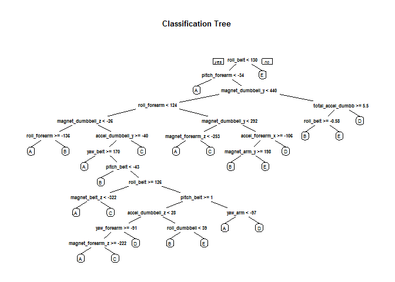

# Practical Machine Learning 030 - Writeup Assignment
Maurizio Pinto  


##Synopsis

The goal of this project is to use the Weight Lifting Exercises dataset (see the References section) to investigate "how (well)" an activity (barbell lift) was performed by 6 participants. Data has been collected by means of on-body sensing approach and the participants were asked one set of 10 repetitions of the Unilateral Dumbbell Biceps Curl in five different fashion:

* exactly according to the specification (Class A)
* throwing the elbows to the front (Class B)
* lifting the dumbbell only halfway (Class C)
* lowering the dumbbell only halfway (Class D)
* throwing the hips to the front (Class E)

Class A corresponds to the specified execution of the exercise, while the other 4 classes correspond to common mistakes.

Read more at the Groupware LES website [http://groupware.les.inf.puc-rio.br/har#wle_paper_section](http://groupware.les.inf.puc-rio.br/har#wle_paper_section)


##Loading and Processing the Raw Data

The training data for this project are available here: 

[https://d396qusza40orc.cloudfront.net/predmachlearn/pml-training.csv](https://d396qusza40orc.cloudfront.net/predmachlearn/pml-training.csv)

The test data are available here: 

[https://d396qusza40orc.cloudfront.net/predmachlearn/pml-testing.csv](https://d396qusza40orc.cloudfront.net/predmachlearn/pml-testing.csv)

An initial analysis of the dataset reveals that missing values are marked as "NA", empty string, or "#DIV/0!". The files are therefore loaded into memory.


```r
training <- read.csv("data/pml-training.csv", na.strings = c("NA", "", "#DIV/0!"))
testing <- read.csv("data/pml-testing.csv", na.strings = c("NA", "", "#DIV/0!"))
```

The dimensions of the datasets are:

* training: 19622 observations of 160 variables
* testing: 20 observations of 160 variables

Many columns contain more that 90% of missing values: since those variables would not be useful for our model, we remove them.


```r
training <-training[,colSums(is.na(training)) == 0]
testing <-testing[,colSums(is.na(testing)) == 0]
```

* training: 19622 observations of 60 variables
* testing: 20 observations of 60 variables

We realize as well that the first seven columns (*X*, *user_name*, *raw_timestamp_part_1*, *raw_timestamp_part_2*, *cvtd_timestamp*, *new_window*, *num_window*) contain variables that are not useful for our model (e.g. the participant name). We then remove them from the dataset.


```r
training   <- training[,-c(1:7)]
testing <- testing[,-c(1:7)]
```

* training: 19622 observations of 53 variables
* testing: 20 observations of 53 variables

The datasets are now ready for the modeling stage.

##Build a predictive model

###Decision tree

We begin with partitioning the first set into training and validation sets (60% for training, 40% for testing):


```r
set.seed(1701)
partition <- createDataPartition(y=training$classe, p=0.6, list=FALSE)
subTraining <- training[partition, ] 
subTesting <- training[-partition, ]
```

We first implement a model by means of a decision tree:


```r
modeldc <- rpart(classe ~ ., data=subTraining, method="class")
predictiondc <- predict(modeldc, subTesting, type = "class")
rpart.plot(modeldc, main="Classification Tree")
```

 

```r
print(confusionMatrix(predictiondc, subTesting$classe))
```

```
## Confusion Matrix and Statistics
## 
##           Reference
## Prediction    A    B    C    D    E
##          A 2001  232   31   75   27
##          B   62  904  124  113  135
##          C   74  209 1083  187  175
##          D   31  104   88  825   56
##          E   64   69   42   86 1049
## 
## Overall Statistics
##                                           
##                Accuracy : 0.7471          
##                  95% CI : (0.7374, 0.7567)
##     No Information Rate : 0.2845          
##     P-Value [Acc > NIR] : < 2.2e-16       
##                                           
##                   Kappa : 0.6795          
##  Mcnemar's Test P-Value : < 2.2e-16       
## 
## Statistics by Class:
## 
##                      Class: A Class: B Class: C Class: D Class: E
## Sensitivity            0.8965   0.5955   0.7917   0.6415   0.7275
## Specificity            0.9350   0.9314   0.9004   0.9575   0.9592
## Pos Pred Value         0.8457   0.6756   0.6267   0.7473   0.8008
## Neg Pred Value         0.9578   0.9057   0.9534   0.9316   0.9399
## Prevalence             0.2845   0.1935   0.1744   0.1639   0.1838
## Detection Rate         0.2550   0.1152   0.1380   0.1051   0.1337
## Detection Prevalence   0.3016   0.1705   0.2202   0.1407   0.1670
## Balanced Accuracy      0.9157   0.7635   0.8460   0.7995   0.8434
```

```r
accuracydc <- sum(predictiondc == subTesting$classe) / nrow(subTesting)
osedc <- 1-accuracydc
```

The accuracy of our first model is only 0.7471323 and the Out-of-Sample error is 0.2528677, so we build a new model based on random forests for better results.

###Random forests


```r
modelrf <- randomForest(classe ~. , data=subTraining, method="class")
predictionrf <- predict(modelrf, subTesting, type = "class")
print(confusionMatrix(predictionrf, subTesting$classe))
```

```
## Confusion Matrix and Statistics
## 
##           Reference
## Prediction    A    B    C    D    E
##          A 2228   11    0    0    0
##          B    4 1500   17    0    0
##          C    0    7 1350   15    0
##          D    0    0    1 1270    3
##          E    0    0    0    1 1439
## 
## Overall Statistics
##                                           
##                Accuracy : 0.9925          
##                  95% CI : (0.9903, 0.9943)
##     No Information Rate : 0.2845          
##     P-Value [Acc > NIR] : < 2.2e-16       
##                                           
##                   Kappa : 0.9905          
##  Mcnemar's Test P-Value : NA              
## 
## Statistics by Class:
## 
##                      Class: A Class: B Class: C Class: D Class: E
## Sensitivity            0.9982   0.9881   0.9868   0.9876   0.9979
## Specificity            0.9980   0.9967   0.9966   0.9994   0.9998
## Pos Pred Value         0.9951   0.9862   0.9840   0.9969   0.9993
## Neg Pred Value         0.9993   0.9972   0.9972   0.9976   0.9995
## Prevalence             0.2845   0.1935   0.1744   0.1639   0.1838
## Detection Rate         0.2840   0.1912   0.1721   0.1619   0.1834
## Detection Prevalence   0.2854   0.1939   0.1749   0.1624   0.1835
## Balanced Accuracy      0.9981   0.9924   0.9917   0.9935   0.9989
```

```r
accuracyrf <- sum(predictionrf == subTesting$classe) / nrow(subTesting)
oserf <- 1-accuracyrf
```

The accuracy of our second model is good 0.9924802 and the Out-of-Sample error is 0.0075198 , therefore we choose this one as our predictive model.

##Results

The model based on random forests can now be applied to the testing dataset:


```r
predictfinal <- predict(modelrf, testing, type="class")
print(predictfinal)
```

```
##  1  2  3  4  5  6  7  8  9 10 11 12 13 14 15 16 17 18 19 20 
##  B  A  B  A  A  E  D  B  A  A  B  C  B  A  E  E  A  B  B  B 
## Levels: A B C D E
```


##References

Velloso, E.; Bulling, A.; Gellersen, H.; Ugulino, W.; Fuks, H. Qualitative Activity Recognition of Weight Lifting Exercises. Proceedings of 4th International Conference in Cooperation with SIGCHI (Augmented Human '13) . Stuttgart, Germany: ACM SIGCHI, 2013.
